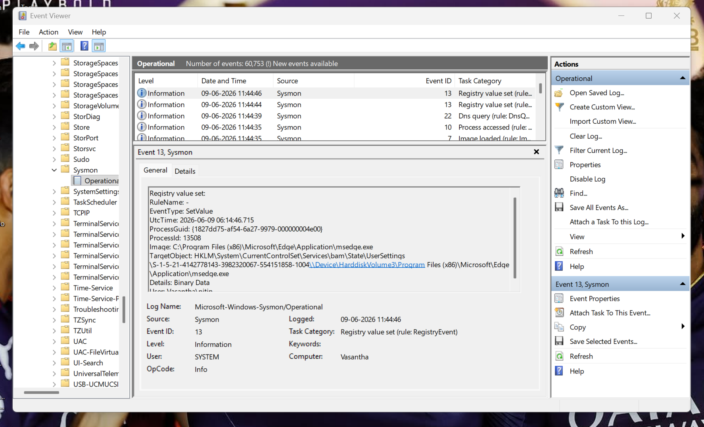
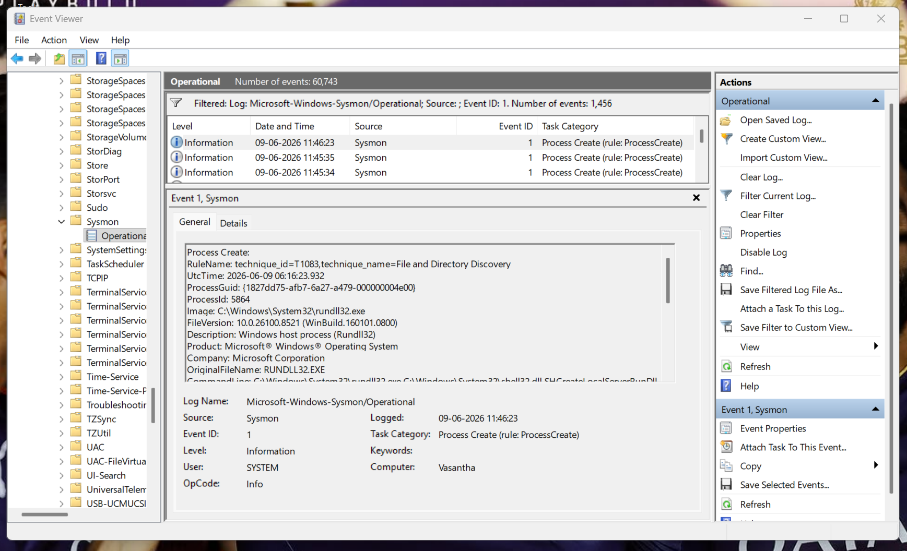
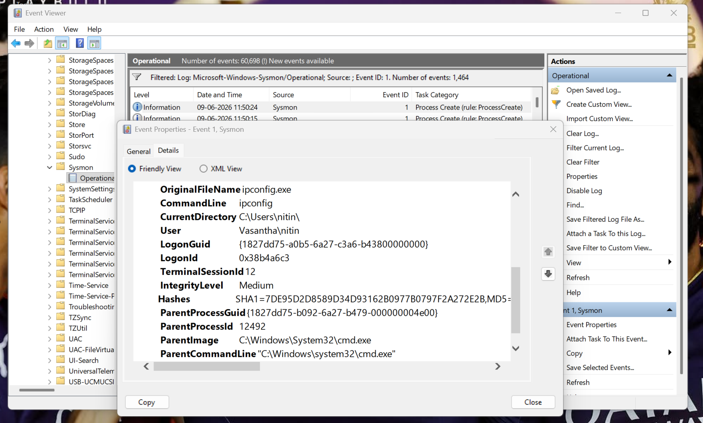
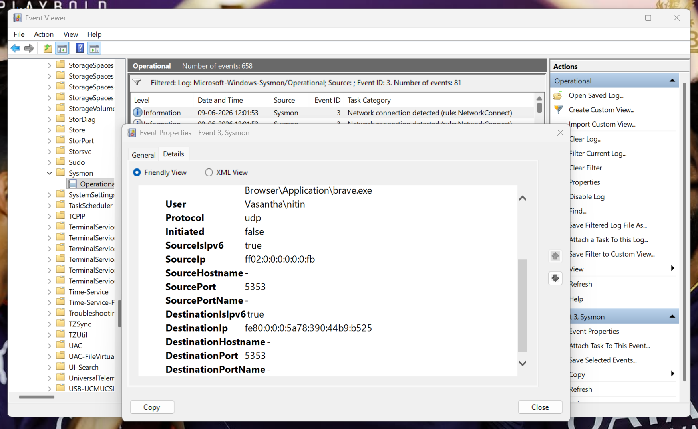
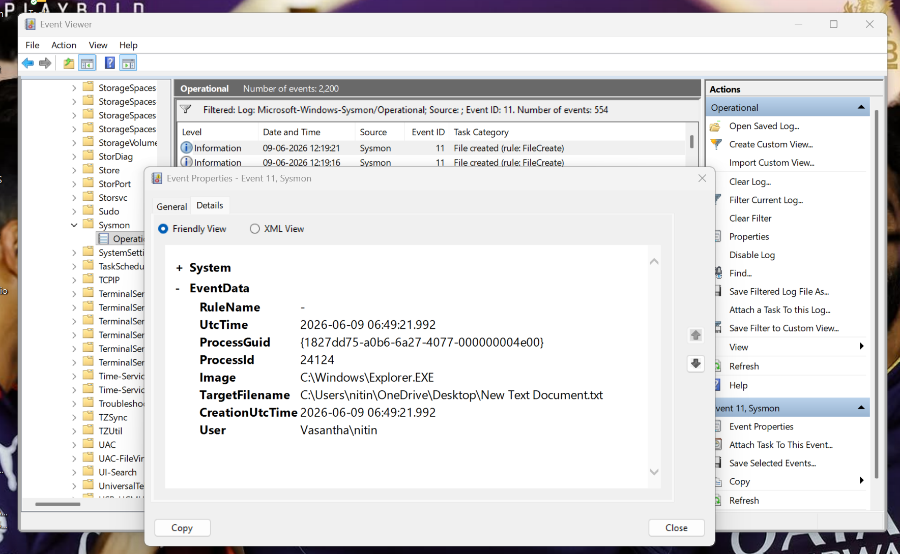
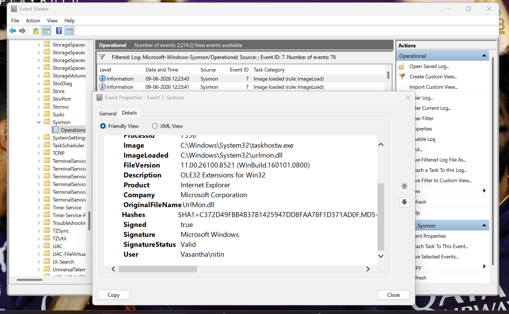
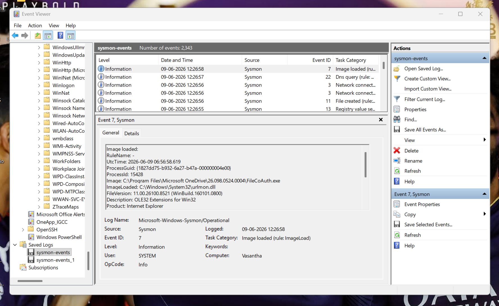
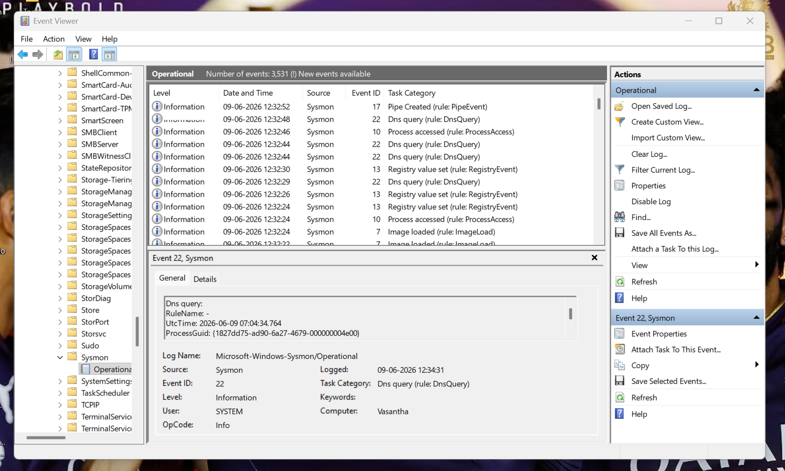

# SOC Lab – Windows Sysmon Log Analysis

## Windows Endpoint Monitoring | Threat Hunting | Incident Investigation | MITRE ATT&CK Mapping


---

# Project Overview

This project demonstrates practical Security Operations Center (SOC) analyst skills through the deployment and analysis of Microsoft Sysmon logs on a Windows endpoint.

Using Sysmon and Windows Event Viewer, endpoint telemetry was collected and analyzed to investigate process execution, network activity, file creation events, image loads, DNS queries, and registry modifications.

The project simulates a real-world SOC investigation workflow and demonstrates security monitoring, threat hunting, event correlation, incident analysis, and MITRE ATT&CK mapping techniques used by security analysts and blue team defenders.

---

# Project Objectives

* Deploy and validate Sysmon endpoint monitoring
* Collect Windows security telemetry
* Investigate process creation events
* Monitor network connections
* Analyze file creation activity
* Review image load events
* Investigate DNS query telemetry
* Examine registry modifications
* Perform threat hunting
* Map findings to MITRE ATT&CK
* Produce professional SOC documentation

---

# Skills Demonstrated

## Security Operations

* Security Monitoring
* Threat Hunting
* Incident Investigation
* Event Correlation
* Endpoint Detection
* IOC Identification
* Security Reporting

## Windows Security

* Sysmon Deployment
* Event Viewer Analysis
* Process Monitoring
* Network Monitoring
* File System Monitoring
* Registry Monitoring

## SOC Analyst Competencies

* Log Analysis
* Threat Detection
* MITRE ATT&CK Mapping
* Detection Engineering Fundamentals
* Security Documentation
* Security Investigations

---

# Lab Environment

| Component            | Details                 |
| -------------------- | ----------------------- |
| Operating System     | Windows 11              |
| Monitoring Tool      | Microsoft Sysmon        |
| Analysis Tool        | Windows Event Viewer    |
| Log Source           | Sysmon Operational Logs |
| Investigation Method | Manual Log Analysis     |
| Framework            | MITRE ATT&CK            |

---

# Project Architecture

```text
Windows Endpoint
        │
        ▼
Microsoft Sysmon
        │
        ▼
Sysmon Operational Logs
        │
        ▼
Windows Event Viewer
        │
        ▼
Event Analysis
        │
        ▼
Threat Hunting
        │
        ▼
MITRE ATT&CK Mapping
        │
        ▼
Security Findings
        │
        ▼
Incident Investigation Report
```

---

# Investigation Walkthrough

## Step 1 – Validate Sysmon Deployment

Verified Sysmon Operational logging through:

Applications and Services Logs → Microsoft → Windows → Sysmon → Operational

### Screenshot



---

## Step 2 – Process Creation Analysis

### Event ID 1

Investigated:

* cmd.exe
* ipconfig.exe
* rundll32.exe

Analyzed:

* Image
* CommandLine
* ParentImage
* User Context

### Findings

Legitimate process execution activity observed.

### Screenshot



---

## Step 3 – Command Execution Investigation

Executed:

```cmd
whoami
ipconfig
```

Sysmon successfully captured command execution telemetry.

### Screenshot



---

## Step 4 – Network Connection Analysis

### Event ID 3

Investigated:

* Browser traffic
* UDP communication
* Network connections

Observed:

* Brave Browser
* UDP Port 5353
* mDNS Communication

### Screenshot



---

## Step 5 – File Creation Analysis

### Event ID 11

Investigated file creation activity generated by Windows Explorer.

Observed:

* New Text Document.txt

### Screenshot



---

## Step 6 – Image Load Analysis

### Event ID 7

Investigated DLL loading activity.

Observed:

* taskhostw.exe
* urlmon.dll

DLL signature verified as Microsoft signed.

### Screenshot



---

## Step 7 – Evidence Collection

Exported Sysmon logs for investigation and documentation.

### Screenshot



---

## Step 8 – Final Analysis Review

Validated multiple Sysmon event categories.

Observed:

* Event ID 1
* Event ID 3
* Event ID 7
* Event ID 11
* Event ID 13
* Event ID 22

### Screenshot



---

# Security Findings

| Finding                       | Result          |
| ----------------------------- | --------------- |
| Sysmon Deployment Verified    | Yes             |
| Process Creation Monitoring   | Successful      |
| Network Connection Monitoring | Successful      |
| File Creation Monitoring      | Successful      |
| Image Load Monitoring         | Successful      |
| DNS Query Monitoring          | Successful      |
| Registry Monitoring           | Successful      |
| Indicators of Compromise      | None Identified |

---

# MITRE ATT&CK Mapping

| Sysmon Event ID | Technique ID | Technique                              |
| --------------- | ------------ | -------------------------------------- |
| Event ID 1      | T1059        | Command and Scripting Interpreter      |
| Event ID 1      | T1016        | System Network Configuration Discovery |
| Event ID 1      | T1033        | System Owner/User Discovery            |
| Event ID 3      | T1071        | Application Layer Protocol             |
| Event ID 7      | T1574        | Hijack Execution Flow                  |
| Event ID 11     | T1074        | Data Staged                            |
| Event ID 13     | T1112        | Modify Registry                        |
| Event ID 22     | T1071.004    | DNS                                    |

---

# Threat Hunting Methodology

The investigation followed a SOC analyst workflow:

1. Collect Endpoint Telemetry
2. Validate Log Sources
3. Investigate Process Activity
4. Analyze Network Communications
5. Review File Creation Events
6. Validate DLL Loading Activity
7. Investigate DNS Queries
8. Correlate Events
9. Map Findings to MITRE ATT&CK
10. Produce Investigation Report

---

# Security Recommendations

## Monitoring

* Deploy Sysmon across enterprise endpoints
* Centralize logs into a SIEM platform
* Continuously review Event ID 1, 3, 7, 11, 13, and 22

## Detection

Monitor:

* powershell.exe
* cmd.exe
* rundll32.exe
* certutil.exe
* mshta.exe
* wscript.exe

## SIEM Integration

Recommended Platforms:

* Splunk
* Microsoft Sentinel
* Elastic Security
* IBM QRadar

---

# Learning Outcomes

Through this project, I gained hands-on experience in:

* Windows Log Analysis
* Sysmon Monitoring
* Threat Hunting
* Event Correlation
* Security Monitoring
* MITRE ATT&CK Mapping
* Incident Investigation
* SOC Operations
* Endpoint Visibility
* Security Reporting

---

# Conclusion

This project demonstrates practical SOC Analyst skills through real-world investigation of Windows Sysmon telemetry. By analyzing process creation, network communications, file creation events, image loads, DNS queries, and registry modifications, comprehensive endpoint visibility was achieved.

The project showcases the security monitoring, threat hunting, log analysis, event correlation, and incident investigation skills required for entry-level SOC Analyst, Security Analyst, Blue Team, and Cloud Security roles.

---

# Author

**Nitin Sukthe**

Future SOC Analyst | Future Cloud Security Engineer

Focused on Security Operations, Threat Detection, Log Analysis, Incident Response, Cloud Security, and Blue Team Engineering.
